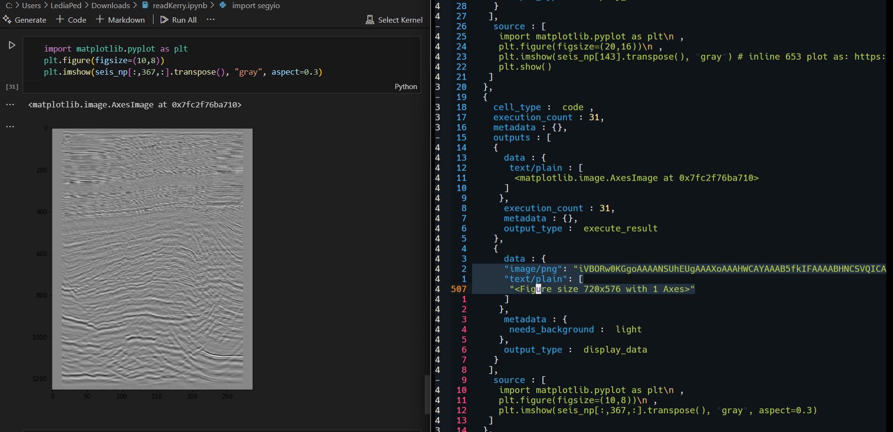
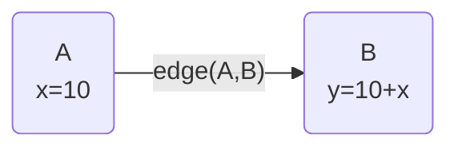

## marimo Notebook instead of Jupyter Notebook

[marimo notebook](https://marimo.io/) is a thing like Jupyter notebook.
[Jupyter notebook](https://jupyter.org/) itself is a web-app for creating and sharing documents, mostly computational documents.

I will talk about why I use Jupyter notebook, and why I started using marimo notebook.

> [!WARNING]+ Disclaimer: I really do think Jupyter notebook is a really great tool for a lot of things, the Jupyter team and the community make a great work around it.
> Hey, at the end of the day, it is just a matter of preference and You always have to go with what You think the best for your condition!

> [!NOTE]- Take a look! Expand me to see what a marimo notebook would look like!
> <iframe src="https://kelreeeeey.github.io/marimo-gh-pages/computational_methods_for_geophysics/gravitational_response_of_a_ball.html?embed=true&show-chrome=false" width="100%" height="700" frameborder="0" </iframe>


## "Why I Use Jupyter Notebook"

> Feel free to skip this part, here, I yap about why I ever stumbled upon Jupyter notebook

[[How is it going so far#how-ive-been-crafting-my-way-through-programming-as-geophysics-student|I was a geophysics student]] when I discover Jupyter Notebook through my lab works.
Ofc, the first thing before notebook itself was Python.
The lab works require me to do programming stuff as part of the curriculum.
It was fun, tbh.
Most of my favourites things as geophysics student was coding after a lab work called "Computational Geophysics" started kicking in my 2nd semester.
Later I found out that the thing that keeping me coding back then was the ability to do such cool visualizations by writing code inside Jupyter Notebook.
Skip forward to 6th-7th semester, #python and coding in general started to take most of my attention.
The biggest indication is I took [[machine learning|Machine Learning]] path at [Google Bangkit Academy in 2022](https://grow.google/intl/id_id/bangkit/?tab=machine-learning), which lead me to do some deep learning for subsurface data as my undergrad thesis project (I think I might write about it, too).
The next semester was a major milestone for me because I took somekinda interneship as part of a research team in my campus.
Most of the works that I do was related to deep leaerning and [[seismic]] data.
I definitely use notebook to do my works for obvious reason.
The ability to do write code and visualize thing in a single place is really important in my opinion.
In fact, most of data scientist especially earth scientist requires visualization skill to do their job.

As I was working as an intern, one of the my job requires me to use remote server to do heavy calculations.
The server serves a Jupyter Lab instance for its users.
I think [Jupyter lab](https://jupyter.org/) is like an environment that wraps Python, data, and collections of Jupyter notebook with very nice additions.
We can interact with data, terminal, and of course the notebooks inside Jupyter lab.

All of those was great.
I even use [Obsidian](https://obsidian.md/) as a tool to help me gather all of my works for monthly report so I made a small tool to convert my notebook to obsidian markdown that takes all of the cells' outputs and save them within the same sub directory within Obsidian vault.
It is in my github repo, [jupyternotebook-to-obsidian-vault](https://github.com/kelreeeeey/jupyternotebook-to-obsidian-vault.git).
Nothing bother me with working inside Jupyter notebook at all.

When I was working on the tool to convert Jupyter notebook to Obsidian markdown, I found out that Jupyter notebook saved as json string in disk.
No wonder the size is so big and parsing it would be a lot or works.
That is why I use [nbconverter](https://github.com/jupyter/nbconvert) to convert jupyter notebook to markdown and work around, modifying some jinja so it can convert things the way I want.

## Ok, The Things That Make Me Rethink "Why I _Still_ Use Jupyter Notebook?"

### These are not necessarily 'the' issues, but hear me out!

We all know that Jupyter notebook is not "reactive". Means that it cannot detect any variable change.
This is related to basic workflow inside Jupyter notebook that You have to go through a loop to refine your works.
You can always write separated python module as a script or a collection of scripts that You can import later in the notebook, but it also means, You always have to run every single cell that relies on the cell where You do `from mymodule import *`, right?.
And it also goes to when You have to change a constant variable.
Because most of the scientists' concern when working inside Jupyter notebook is that they have their code either within the notebook or somewhere else that they could run and see the outputs.

Things will be complicated as notebook grows bigger as the works inside it grow.
There is no separation between the code and the cells' output in term of separation of preservation.
Jupyter notebook saves the code and cells' output in a single place, the json with specific format called `ipynb`.
Other thing related to this specific issue is that this ipynb file is not git friendly all the time.
An example of this, is when You have images that are produced by any visualization library, Jupyter notebook will always store those images as string within the json.
So everytime an image changes, a big part of the json string will always change.
<figure>  <figcaption><strong>Fig 1: Jupyter notebook and its JSON. (<code><a href="https://github.com/anyuzoey/SEGY2NUMPY/blob/main/readKerry.ipynb">readKerry.ipynb</a></code> by <a href="https://github.com/anyuzoey">anyuzoey</a>)</strong></figcaption> </figure>
As you can see above figure that depicts side-to-side view of a Jupyter notebook's cell that shows an image produced by <code>matplotlib.pyplot.imshow</code> and its json which I highlighted.

Those above are the "issue" with Jupyter's lower-level protocols which are not really a big problem for a singel user, when You're wokring alone. _Jupyter indeed is a great tool_.

### However, the real problem will be asserted as You work with other people.

I found that it is kinda hard to replicate and ensure the reproducibility of works that are done within Jupyter notebook.
The other thing about Jupyter notebook is the order of cell execution even if all variables inside Jupyter notebook (IPyKernel) are registered in "global variable" i.e the mutable workspace.
Those let You can always define variables anywhere in any cell as well as override variables with new value and so on so forth.
But You have to make sure that the cells (or variables) are placed in the correct order of execution (top to bottom) in order for the other cells that require variables from other cells can be run without any erros, at least `NameError`--the error that rises when You don't have any variable with given name.
This will lead to problem when You have to share your works with your colleagues without giving any additional works to ensure they can replicate your work properly in their own environment and machine.

Not to mention the third party libraries, Python version, and things that differentiate between your environment You colleagues'.
At this point, some of You may argue that above things are not necessarily an issue of using Jupyter notebook. You might be right, because We are not sharing the exact same experience.

## Now, I Am Telling You That There Exists Another Type of Notebook Called "marimo"

> "[marimo](https://marimo.io/) is a reinvention of the Python notebook as a reproducible, interactive,
> and shareable Python program, instead of an error-prone JSON scratchpad."
>
> marimo team, 2025

marimo really is a game changer for any data science project development, I'm telling You!!
It's the reactivity for me.
It's the 'notebook.py' instead of 'notebook.ipynb' for me.
And it's the ✨ _fancy_ ✨ UI elements for me.

### First of All

> [!INFO]- [Where did marimo came from?](https://marimo.io/blog/slac-marimo)
>
> Stanford’s SLAC National Accelerator Laboratory. Scientists there need a _new_ Python notebook for their data-heavy works.
>
> One of marimo's founding father, [Akshay](https://www.akshayagrawal.com/), was working on vector embeddings during his PhD at Stanford using Jupyter notebook a lot. At the end of it, He came to realization of what a "notebook" should be.
> > _"Before it was open source, the marimo Python notebook was originally developed with input from computational scientists at Stanford’s SLAC National Accelerator Laboratory. These scientists needed a new programming environment for their iterative, data-heavy coding work — one that was reproducible and reusable by default."_
> >
> > ~[Why Stanford scientists needed a new Python notebook](https://marimo.io/blog/slac-marimo)


The usage of notebook is really just revolving around having your codes and their outputs in a single place which You can both interactively and iteratively working on, changing them around and see their outputs in one place.
Reducing even completely cutting of the loop of running the script via command line just to change a single variabe or fix some typos.
In fact this is the fundamental realization of one of the marimo founder, [Akshay Agrawal](https://www.akshayagrawal.com/). On his [interview](https://Youtu.be/-faSV7U4acQ?si=78EZMcKAmrSL-AwO) with [Weigth & Biases](https://wandb.ai/site), He said that;

> "It is really valuable to have programming environment that lets You see your data while your're working on it."


[Akshay](https://www.akshayagrawal.com/) has several considerations when He firts set out to build marimo--a Python notebooks should be

1. Reproducible: Code and outputs should always be in sync,
2. maintainable: pure Python, so it is versionable and portable, and
3. Multi-purpose: not just as a notebook but can be shared as web-app, can be execute as a script without jumping through extra hoops.

He also mentioned in the same interview, several cool project was inspired him to build marimo, which are;

- [Pluto.jl](https://plutojl.org/) from [Julia language](https://julialang.org/), and
- [Streamlit](https://streamlit.io/)

Pluto is reactive notebook from Julia, and Streamlit is a tool to build a sharebale web apps.
People were MIGRATING from Python (Jupyter) to Julia because Pluto.jl.
At my first encounter of Julia and then Pluto.jl (it was like 2-3 years ago) through a class about Computational Programing for Geophysics I took,
I was thinking like, "WHY WE DON'T HAVE THING LIKE THIS IN PYTHON?".

### Reproducibility

The probem about reproducibility which is purely on the Jupyter notebook's users. A study from New York University and Federal Fluimenense--["A Large-scale Study about Quality and Reproducibility of Jupyter Notebooks"](https://leomurta.github.io/papers/pimentel2019a.pdf)--found that;
> _**863,878** Jupyter notebooks on GitHub with valid execution orders, only 24% could be re-run and just 4% reproduced the same results._

Similar study from [2020 by JetBrains](https://blog.jetbrains.com/datalore/2020/12/17/we-downloaded-10-000-000-jupyter-notebooks-from-github-this-is-what-we-learned/) found that;
> _Over a third of the notebooks on GitHub had invalid execution histories._


marimo came with idea that a notebook can be modeled as [directed acyclic graph (DAG)](https://en.wikipedia.org/wiki/Directed_acyclic_graph) ([marimo, 2024](https://marimo.io/blog/lessons-learned)). Directed acyclic graph (DAG) comes to eliminating hidden state.
marimo marks each cell with the variables it defines and the variables it references.
The graph is formed using static analysis, reading the code without running it.

DAG encodes dependencies across cells which specify how variables flow from one cell to another ([marimo, 2024](https://marimo.io/blog/lessons-learned)).
There's and edge `(A, B)` if `B` references any of the variables defined by `A`.

<div align="center">


</div>


The semantic of the graph above means that
1. `A` is the parent of `B`
2. `B` reads variable `x` defined by `A`
3. then, `B` _has to run **after**_ `A`

This design decision of marimo comes with a set of contracts to make sure every notebook is a DAG, we--as user--must accept that

1. Variables **can't** be reassigned
2. cells **can't** have cycles, `x = y`, `y = x`
3. avoid mutating variables across cells.


### Maintainable

Saving the notebook as flat Python files (`.py`) comes with following properties ([marimo, 2024](https://marimo.io/blog/lessons-learned));

1. git-friendly; leads to small code change => small diff
2. easy for both human and computer to read
3. importable as a Python module
4. executable as a Python script
5. editable with text editor

> [!INFO]- Take a look of the Python file of a marimo notebook!
> ```python
> import marimo
>
> __generated_with = "0.4.12"
> app = marimo.App()
>
> @app.cell
> def A():
>     x = 0
>     return x,
>
> @app.cell
> def B(x):
>     y = 10 + x
>     y
>     return y,
>
> if __name__ == "__main__":
>     app.run()
> ```

### Multi-purpose

Reproducible and maintainable notebook is naturally multi-purpose.
It can be;

1. Run as an app, and
2. Execute as a script.

marimo can run a notebook as an app because the notebook itself is a DAG. Because of the nature of DAG, and combine it the basis of modern web apps--reactivity--marimo can turn the Python file into apps by just hiding the code, showing the outputs and serving them in a read-only mode just by <br><center>`marimo run notebook.py`</center><br>in your favorite terminal.

marimo notebook can also be executed as a python script--<br><center>`python notebook.py`</center><br>--because of the `if __name__ == "__main__"` guard, the `app` API and `@app.cell` decorator You see in the previous section.
This is possible because the nature of DAG which is 'stored' or 'implemented' by the `app` API that 'remembers' the order of the execution and variables dependency so that it can be ran just like a regular Python script.
marimo also has the built-in support for [command-line arguments](https://docs.marimo.io/api/cli_args.html#marimo.cli_args) so we can have as many parameters as we want to be passed into the script.

### Sync your Code and your Outputs

No matter how, executing the same notebook should produce the same outputs. This is the problem of Jupyter notebook experience -- the frontend and IPython kernel that we as scientists use.

> [!INFO]+ marimo automatically keeps code and outputs in sync. When we run a cell, all other cells that depend on its variables are marked as stale showing the __reactivity aspect of marimo__.
>
> <figure>  <figcaption><strong>Fig 2: marimo reactivity. (<a href="https://marimo.io/blog/lessons-learned">marimo, 2024</a>)</strong></figcaption> </figure>

> [!INFO]+ This reactivity allows marimo to easily integrates interactive widgets, like slider, dropdown menus, etc.
>
> <figure>  <figcaption><strong>Fig 3: marimo reactivity with interactivity using <code>marimo.ui.slider</code>. (<a href="https://marimo.io/blog/lessons-learned">marimo, 2024</a>)</strong></figcaption> </figure>

## Time to Play

marimo also comes with a really cool features, I'm just gonna put marimo's highlights from their documentations just because.

> [!INFO]+ The ✨good parts of marimo✨🤌🧑‍🍳💋
> <iframe src="https://docs.marimo.io/#highlights" width="100%" height="550" style="overflow: hidden;" scrolling="no"></iframe>

The one that really excites me is that You can convert your marimo notebook into a web app that can run Python directly into your browser.
This is possible because of [Pyodide](https://pyodide.org/en/stable/project/about.html) which is Python distribution for the browser based on WebAssesmbly.
This means that You can deploy your notebook as a static web page without any backend.
This is like a heaven for scientist--that only care for the Python code and hate/do not care to write JavaScript or any web related stuff--to share their notebooks to the world.

Below is a marimo notebook that I wrote for this articel for You to play with, so that You dont't have to install marimo in your machine if You don't want too.
This is a web-app that I deplyoed in [my GitHub page](https://kelreeeeey.github.io/marimo-gh-pages/).
You can basically do any basic python inside it, so try it out!
<iframe
  src="https://kelreeeeey.github.io/marimo-gh-pages/notebooks/marimo_notebook.html?embed=true&show-chrome=false"
  width="100%"
  height="1200"
  frameborder="0"
></iframe>

The notebook that You probaly have seen on the top page of this article is infact a marimo notebook that I also made and deployed in [my GitHub page](https://kelreeeeey.github.io/marimo-gh-pages/). They deserve another articel of me yapping but feel free to check them out.

With all that being said. I'll happily end this article where I yap about lovely marimo. ThankYou for your time, I hope You guys--fellow data scientists, or any person in charge of any research with a lot computation involving large amount of data--would consider to adopt marimo as a part of your handy tools in your development environment.

Thank You for your time, sincerly

~Rey

## References

> [!INFO]- List of references
>
> - [marimo notebook](https://marimo.io/)
> - [Jupyter Notebook](https://jupyter.org/)
> - [nbconverter](https://github.com/jupyter/nbconvert)
> - [Bennet, David, Akshay and Myles (2025) Why Stanford scientists needed a new Python notebook](https://marimo.io/blog/slac-marimo)
> - [About marimo](https://marimo.io/about)
> - [Akshay Agrawal](https://www.akshayagrawal.com/)
> - [Weigth & Biases](https://wandb.ai/site)
> - [Pluto.jl](https://plutojl.org/)
> - [Streamlit](https://streamlit.io/)
> - ["We Downloaded 10,000,000 Jupyter Notebooks From Github – This Is What We Learned"](https://blog.jetbrains.com/datalore/2020/12/17/we-downloaded-10-000-000-jupyter-notebooks-from-github-this-is-what-we-learned/)
> - ["A Large-scale Study about Quality and Reproducibility of Jupyter Notebooks"](https://leomurta.github.io/papers/pimentel2019a.pdf)
> - [directed acyclic graph (DAG)](https://en.wikipedia.org/wiki/Directed_acyclic_graph)
> - [Lesson Learned Reinventing The Python Noteook](https://marimo.io/blog/lessons-learned)

