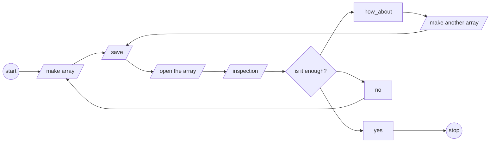

> [!WARNING]+ **BIG DISCLAIMER!!**
>
> I am a rookie in Odin.
>
> I might have a lot of faults and misinterpretation of things on this work. Please take this
> article with a BIG grain of salts, cz tbh, I am learning.
>
> I wanna know how things work.
>
> I also wanna be corrected if I am wrong.
>
> There will be bunch of senteces that might be confusing to You due to grammars. I'm so sorry,
> I am trying, yk, born in non-spekaing english country sometimes sucks.
>
> AND PLEASE DO NOT USE THIS IN ANY OF YOUR PRODUCTION!, duh?!

I already did decode the `.npy` files in my repo [python-numpy-npy-in-odin](https://github.com/kelreeeeey/python-numpy-npy-in-odin),
So, if You are more interested to dig and find out yourself, you are welcomed to check that repo ;D

## This whole thing in a nutshell

1. [[#Tools I used when working on this:|I'll inform You tools I used]]
2. [[#Motivation(s)|I'll inform You what are my motivations]]
3. [[#Motivation(s)|I'll inform You what are my sources ]]
4. [[#Small research|I'll inform You WHAT]] & [[#ok, now I am going to talk about "How" the examples implement things, in Odin.|HOW]]  I learned from the sources
5. [[#Now, we are talking. How the Numpy's .npy file actually looks like?|I'll inform You how I help myself to extract informations ]]
6. [[#The Final part|I'll inform You how I did read .npy files in Odin e.i. How to use the final product]]
7. And finally, You are free to choose to read [[#What I learned from this small project|What I learned from this small project]] or go, see You later 🤘😁
8. [[#References|The references]]

## Tools I used when working on this:

1. [Python  v `3.10`](https://www.python.org/downloads/release/python-31016/)
2. [Numpy  v `1.26.4`](https://numpy.org/devdocs/release/1.26.4-notes.html)
3. [Odin v `dev-2025-03`](https://odin-lang.org/)

## Motivation(s)

I've been working with [Numpy](https://github.com/numpy/numpy) in [Python](https://www.python.org/) since day-1 I put my fingers
on keyboards coding in Python. Most of the times, it involves saving-and-loading
data using Numpy.

As a Geophysics student, multi dimensional arrays/matrix is an absolute objects
I very often cannot avoid while writing programs, like, dead ahh absolute.

Okay, now that I'm embracing myself to code in lower-level language (relative than
Python), in this case, [Odin](https://odin-lang.org/), I want to utilize what I have been using and
producing using Numpy in Python inside Odin. But there is no such a thing `numpy.load(the_file)`
inside Odin and as far as my ability to surf and dig out the internet, I haven't
found single person doing such a thing, you know, to *avoiding re-inventing the wheel*.
So, I might need to do it myself, manually.

## Small research

### The "What" and "Why"

First things first, I have to read. I need to find the "What", "How", and "Why", to be
able to do the works. But wait, what is exactly the things we are dealing with, again?.

* It's `.npy` files.
* Who made it? Numpy.

So logically, Numpy is the correct source where I can find "why they made it", and "how they
made it". Here's what I found in [Numpy Enhancement Proposal (NEP)-1](https://numpy.org/neps/nep-0001-npy-format.html)

> ...
> _We propose a standard binary file format (NPY) for persisting a single arbitrary NumPy array on disk. The format stores all of the shape and dtype information necessary to reconstruct the array correctly even on another machine with a different architecture. The format is designed to be as simple as possible while achieving its limited goals. The implementation is intended to be pure Python and distributed as part of the main numpy package._
> ...
>
> **Kern, R. (2007)**

What I can take, solely based on above;

* The format stores all the shape and dtype (data type) informations.
* That informations are necessary to reconstruct the array/data correctly
no matter what kinda devices we use.
* The format guaranteed to be as simple as possible to achieve its limited goals.
* The implementations is intended to be pure Python as part of Numpy.

**Note:** I took that as the "Why" it existed.

### The "How", but first, I need me some examples.

Now, I need some example on how to work with non-native data type and files in Odin.
I found this article ["Reverse Engineering Alembic"](https://www.gingerbill.org/article/2022/07/11/reverse-engineering-alembic/) by [Ginger Bill](https://www.gingerbill.org/). [Alembic] is an interchange file format.
Alembic is written in C++. Bill need to work with Alembic as part of his works in [JangaFX](https://jangafx.com/)
which requires him to read and write Alembic format in Odin.

From that article, Bill basically explain following points;

1. The Header
    * what it is.
    * how the header be layouted in memory.
    * how to read them in correct way.

2. The Data
    * what are they.
    * how alembic structure it's data.
    * how the relation between the data.
    * how the layouted in memory, and how to correclty extract them in correct format.

Bill also would recommend us to use _hex-viewer_ to bytes in a readable way, since we are working
with binary formats. Through this work, I use [Hex Editor Neo](https://www.hhdsoftware.com/free-hex-editor).

I also came accross [Rickard Andersson's YouTube](https://www.youtube.com/@mccGoNZooo) videos. I learned A LOT
from his videos. In one of Rickard's videos, he talked about [_bitwise operations_](https://youtu.be/JaOKqXJT4d4?si=dUDrYYE9tC4tuD6m)
which basically, at least how I percieved it, tells me how to work with
bytes, and hex. Rickard then gave example on how byte can be used to represent a set
of flags (in the case, it was boolean values) that hold certain informations.
Rickard gave the example using [LZ4](https://github.com/lz4/lz4/blob/dev/doc/lz4_Frame_format.md) which is
a tool to compressing file.

I specifically watched these playlists which where I found that bitwise operation video:

1. [The Odin programming language with Rickard](https://youtube.com/playlist?list=PLEQTpgQ9eFCGlQa2z0j_TQTGggHOIF8Z1&si=nxXgXCB5N0-F0s7D)
2. [Odin in Practice](https://youtube.com/playlist?list=PLEQTpgQ9eFCEg0CTd0KkiqgUpP5V0JM4-&si=oZJoIuzr9s7GXVWu)

I also learn that the impotance of [Byte Order, Endianness](https://youtu.be/VVwbuij_c-Q?si=swPtmyfB6ASxPY-x)
which also I acquire from Rickard's videos.
Endianness refers to how bytes are stored in specific order. The orders are:

1. Largest first
2. Smallest first

The endianness actually represent the significancy of those orders

I think [endiannes](https://en.wikipedia.org/wiki/Endianness) is like setting up the base of our assumptions when we
communicate, but insteadd of human, the subjects are computers.

It matters because human tends to assume over things. the value is stays the same
but one's perception about it could be varies. So this endianness gives us a way to
specify and unify the perception upon things its like top-down/down-top approach on a problem

Another thing I found through this journey, is [_bytes-stream_](https://en.wikipedia.org/wiki/Bitstream#:~:text=A%20bytestream%20is%20a%20sequence,translation%20between%20bytestreams%20and%20bitstreams.).
Bytes-stream refers to a sequence of bytes. I came accross this very nice visualization
of bytes-stream by [Overcoded](https://en.wikipedia.org/wiki/Bitstream#:~:text=A%20bytestream%20is%20a%20sequence,translation%20between%20bytestreams%20and%20bitstreams.) in a Medium
article by [West, Z. 2020](https://alphazwest.medium.com/?source=post_page---byline--646343b3d679---------------------------------------), ["What's A Byte Stream, Anyway"](https://alphazwest.medium.com/whats-a-byte-stream-anyway-646343b3d679).

> [!INFO]- Illustrations of byte and byte-stream
>    
>
>    

>[!NOTE] Note by West, Z. (2020)
> _In the illustration above, the solid black boxes separating 8-bit groups are purely for visualization purposes only. Such a gap in information would not be present in practice._

### ok, now I am going to talk about "How" the examples implement things, in Odin.

#### How Bill, G. (2022) doing with Alembic

Under [What is Alembic?](https://www.gingerbill.org/article/2022/07/11/reverse-engineering-alembic/#what-actually-is-alembic)
section, Bill, G. (2022) says that, "Alembic consits of 2 file formats with different memory layout
which can be determined based on [magic file signature](https://en.wikipedia.org/wiki/List_of_file_signatures)".
Those 2 file formats are;

1. [HDF5](https://www.hdfgroup.org/), and
2. [Ogawa](https://github.com/alembic/alembic/wiki/Ogawa-Specification).

HDF5 commonly being used to store data in _hierarchical_ kinda way. Ogawa, also stores the data
in _hierarchical_ fashion, but uncompressed. And it seems like majority of "Alembic" are not in
HDF5 format, but in Ogawa (Bill, G. 2022). Ogawa format is `little-endian-binary-format`.

Here's how Bill, G. structured his way to define a very simple Ogawa's header in Odin.

```odin
// this is Odin lang
// source: https://www.gingerbill.org/article/2022/07/11/reverse-engineering-alembic/#ogawa

MAGIC :: "Ogawa"

File_Header :: struct {
	magic:   [5]byte, // "Ogawa"
	wflag:   enum byte { writing = 0x00, closed = 0xff },
	version: [2]byte, // {0, 1}
	root_group_offset: u64le,
}
```

That is an Odin's `struct`. How did He know it? well, I am assuming He just read the Ogawa docs.
Notice that Bill, G. used `[5]byte` as the type for `magic` field which was encoded while Ogawa
file format is created, and save information "Ogawa" as the magic.

I ain't going through all the fields of the Ogawa `File_Header struct` above, since it is not
my concern. The major things I saw from Bill's works is that, we have to know certain things;

1. What are the information the header would be holding.
2. How the informations are being laidout in memory.
3. What are the data type of each information.
4. What is the endianness, that important for us to work with 'em bytes-stream.

How do we know those things?

* Read the official docs
* Messin' around and hope for the best.

Well, I guess, reading is the best way before messing around. So, it brought me to the next
example, which is came from [Rickard Andersson's YouTube, about "Bitwise Operation"](https://youtu.be/JaOKqXJT4d4?si=l1Uw0q6-F4wkeODW&t=1372) where Rickard talked about the example of
[LZ4](https://github.com/lz4/lz4/blob/dev/doc/lz4_Frame_format.md). Specifically on [General Structure of LZ4 Frame Format](https://github.com/lz4/lz4/blob/dev/doc/lz4_Frame_format.md#general-structure-of-lz4-frame-format)
and [Frame Descriptor](https://github.com/lz4/lz4/blob/dev/doc/lz4_Frame_format.md#frame-descriptor)


>[!ABSTRACT]- Here's a snippet of LZ4 documentation about frame format
> source: [lz4 github](https://github.com/lz4/lz4/blob/dev/doc/lz4_Frame_format.md#general-structure-of-lz4-frame-format)
>
> | MagicNb | F. Descriptor | Data Block | (...) | EndMark | C. Checksum |
> |:-------:|:-------------:| ---------- | ----- | ------- | ----------- |
> | 4 bytes |  3-15 bytes   |            |       | 4 bytes | 0-4 bytes   |
>
> __Magic Number__ : 4 Bytes, Little endian format. Value : 0x184D2204
>
> __Frame Descriptor__ : 3 to 15 Bytes, to be detailed in its own paragraph, as it is the most important part of the spec.
>
> __Data Blocks__: To be detailed in its own paragraph. That’s where compressed data is stored.
>
> __EndMark__ : The flow of blocks ends when the last data block is followed by the 32-bit value `0x00000000`.
>
> __Content Checksum__ : Content_Checksum verify that the full content has been decoded correctly. The content checksum is the result of xxHash-32 algorithm digesting the original (decoded) data as input, and a seed of zero. Content checksum is only present when its associated flag is set in the frame descriptor. Content Checksum validates the result, that all blocks were fully transmitted in the correct order and without error, and also that the encoding/decoding process itself generated no distortion. Its usage is recommended.
>
> The combined EndMark and Content_Checksum fields might sometimes be referred to as LZ4 Frame Footer. Its size varies between 4 and 8 bytes.

## Now, we are talking. How the Numpy's .npy file actually looks like?

1. I read [Numpy's (v1.26.4) documentation about data types](https://numpy.org/doc/1.26/user/basics.types.html)
2. I looked up into [Numpy's Github repository "_format_impl.py"](https://github.com/numpy/numpy/blob/82610b4edaf474895a9f4b3ecc0749c7c297099a/numpy/lib/_format_impl.py#L704) ^npyformatimpl


> [!INFO]- Numpy Types
>
> nb: following table was copied and reformated from [Numpy's (v1.26.4) documentation about data types](https://numpy.org/doc/1.26/user/basics.types.html)
>
> | Numpy Type                   | C Type                  | Description                                                                 |
> |------------------------------|-------------------------|-----------------------------------------------------------------------------|
> | `numpy.bool_`                | `bool`                  | Boolean (True or False) stored as a byte                                     |
> | `numpy.byte`                 | `signed char`           | Platform-defined signed 8-bit integer                                        |
> | `numpy.ubyte`                | `unsigned char`         | Platform-defined unsigned 8-bit integer                                      |
> | `numpy.short`                | `short`                 | Platform-defined signed 16-bit integer                                       |
> | `numpy.ushort`               | `unsigned short`        | Platform-defined unsigned 16-bit integer                                     |
> | `numpy.intc`                 | `int`                   | Platform-defined signed 32-bit integer                                       |
> | `numpy.uintc`                | `unsigned int`          | Platform-defined unsigned 32-bit integer                                     |
> | `numpy.int_`                 | `long`                  | Platform-defined signed 64-bit integer (common default integer type)        |
> | `numpy.uint`                 | `unsigned long`         | Platform-defined unsigned 64-bit integer                                     |
> | `numpy.longlong`             | `long long`             | Platform-defined signed 64-bit integer                                       |
> | `numpy.ulonglong`            | `unsigned long long`    | Platform-defined unsigned 64-bit integer                                     |
> | `numpy.half` / `numpy.float16` | -                     | Half-precision float: 1 sign bit, 5 exponent bits, 10 mantissa bits         |
> | `numpy.single`               | `float`                 | Single-precision float: 1 sign bit, 8 exponent bits, 23 mantissa bits       |
> | `numpy.double`               | `double`                | Double-precision float: 1 sign bit, 11 exponent bits, 52 mantissa bits      |
> | `numpy.longdouble`           | `long double`           | Platform-defined extended-precision float                                    |
> | `numpy.csingle`              | `float complex`         | Complex number with two single-precision floats (real and imaginary parts)  |
> | `numpy.cdouble`              | `double complex`        | Complex number with two double-precision floats (real and imaginary parts)  |
> | `numpy.clongdouble`          | `long double complex`   | Complex number with two extended-precision floats (real and imaginary parts) |
>
> ^npdtypes


Now that I got at least the information of types that Numpy implements, I need to know what they
would look like in `.npy` files, like 'em binaries.

Here's the flow diagram of how I did it.



### Now we're playin with Numpy

1. Making the arrays, for simplicity, I'll make 2 arrays, 1st one is 1D array
and the other is 2D array.

> [!ABSTRACT]- Making Numpy arrays
>  ```python
>  import numpy as np
>
>  def make_integer_arrays() -> None:
>      # ...
>
>      int8_5 = np.arange(1, 6, 1).astype(np.int8)
>      # array([1, 2, 3, 4, 5], dtype=int8)
>
>      uint8_5   = np.arange(1, 6, 1).astype(np.uint8)
>      uint8_5x5 = np.array(list(uint8_5 + x for x in range(5)))
>      # array([[1, 2, 3, 4, 5],
>      #        [2, 3, 4, 5, 6],
>      #        [3, 4, 5, 6, 7],
>      #        [4, 5, 6, 7, 8],
>      #        [5, 6, 7, 8, 9]], dtype=uint8)
>
>      np.save("./test_data/ints/int8_5.npy", int8_5)
>      np.save("./test_data/ints/uint8_5x5.npy", uint8_5x5)
>
>      # ...
>
>      return None
>
>  def main() -> None:
>      make_integer_arrays()
>      return None
>
>  if __name__ == "__main__":
>      main()
>
>  ```

2. Load-in the arrays

> [!ABSTRACT]- Loading in Numpy arrays
>  ```python
>  def main():
>      with open("./test_data/ints/int8_5") as f:
>          data = f.readlines()
>
>      print(data)
>      # ["“NUMPY\x01\x00v\x00{'descr': '|i1', 'fortran_order': False, 'shape': (5,), }                                                            \n", '\x01\x02\x03\x04\x05']
>
>      with open("./test_data/ints/uint8_5x5.npy") as f:
>          data2 = f.readlinees()
>
>      print(data2)
>      # ["“NUMPY\x01\x00v\x00{'descr': '|u1', 'fortran_order': False, 'shape': (5, 5), }                                                          \n", '\x01\x02\x03\x04\x05\x02\x03\x04\x05\x06\x03\x04\x05\x06\x07\x04\x05\x06\x07\x08\x05\x06\x07\x08\t']
>
>
>  if __name__ == "__main__":
>      main()
>
>  ```


With those simple examples, we can see that for each `.npy` files, we got those alien strings
for the `int8_5.npy` we got these

```raw
"“NUMPY\x01\x00v\x00{'descr': '|u1', 'fortran_order': False, 'shape': (5, 5), }                
\n"
```

followed by these

```raw
'\x01\x02\x03\x04\x05\x02\x03\x04\x05\x06\x03\x04\x05\x06\x07\x04\x05\x06\x07\x08\x05\x06\x07\x08\t'
```

Okay, to construct the data, we definitely need information, right?,
we now use that strange lookin' header to find out what informatio we
could get.

In [ Numpy-npy format specification verision 1.0 ](https://numpy.org/neps/nep-0001-npy-format.html), Numpy mentioned that;

1. The first **6 bytes** are a `magic string`, exactly `x93NUMPY`
2. the next **1 byte** is `unsigned byte`, which tells us the major version number of the file format
3. the next **1 byte** is also `unsigned byte`, which tells us the minor version number of the file format
4. The next **2 bytes** form a `little-endian unsigned short int` (whoah, that's a LOT), it is the length of the header which Numpy refers to `HEADER_LEN`.
5. Now, the next `HEADER_LEN` bytes, is the header data describing the array's format. It is an ASCII string, which contains Python literal expression of a dictionary.


### How would it look like in Odin, then?

#### The header and eveyrthin'

Now, I am going to test my Odin amateur skill to represent those things above

> [!ABSTRACT]- `NumpyHeader` struct
>
>  ```odin
>  // this is a piece of Odin
>
>  MAGIC :: []u8{0x93, 'N', 'U', 'M', 'P', 'Y'}
>  MAGIG_LEN := len(MAGIC)
>  DELIM : byte = '\n' // tbh, I don't really know why I define this DELIM, lol.
>
>  NumpySaveVersion :: struct {
>      maj: u8,
>      min: u8
>  }
>
>  Descriptor :: struct {
>      descr: string,
>      fortran_order: bool,
>      shape: [dynamic]int,
>      endianess: endian.Byte_Order,
>  }
>
>  NumpyHeader :: struct #packed {
>      magic: string,
>      version: NumpySaveVersion,
>      header_length: u16le,
>      header: Descriptor,
>  }
>
>  // a lil helper to clean mess up
>  delete_header :: proc(h: ^NumpyHeader) {
>      delete (h.magic)
>      delete (h.header.shape)
>      delete (h.header.descr)
>  }
>
>  ```

The `NumpyHeader` struct is a `#packed` struct, which is a [ _struct directive_ ](https://odin-lang.org/docs/overview/#struct-directives).
Different struct directive will gives us different memory layout and alignment
requirements. In this case, `NumpyHeader` will not have any padding between its fields.
Following code block will show You directives of struct in Odin.

```odin
// this is also Odin
// source: odin-lang.com/docs/overview/

struct #align(4) {...} // align to 4 bytes
struct #packed {...} // remove padding between fields
struct #raw_union {...} // all fields share the same offset (0). This is the same as C's union
```

#### Hollup, lemme go back to creating more arrays, but this time, I'll do more

Now, I wanna go back to creates Numpy arrays with all data types that Numpy v1.26.4 got (see [[#^npdtypes|Data types table]])
The full script is in my Github repository in [generate_array.py](https://github.com/kelreeeeey/python-numpy-npy-in-odin/blob/main/generate_array.py).
I created of 1D (postfix-ed by `_5.`) and 2D arrays (postfix-ed by `_5x5` ), and now I got these bad boys.

> [!INFO]- produced `.npy` files
>  ```bash
>  ls -LASR
>
>  ./floats:
>  cdouble_5x5.npy      float64_5x5.npy     cdouble_5.npy      csingle_5.npy     float32_5.npy
>  clongdouble_5x5.npy  longdouble_5x5.npy  clongdouble_5.npy  double_5.npy      single_5.npy
>  csingle_5x5.npy      float32_5x5.npy     float16_5x5.npy    float64_5.npy     float16_5.npy
>  double_5x5.npy       single_5x5.npy      half_5x5.npy       longdouble_5.npy  half_5.npy
>
>  ./ints:
>  int64_5x5.npy      uintc_5x5.npy   ulonglong_5.npy  int32_5.npy  ushort_5.npy
>  longlong_5x5.npy   int16_5x5.npy   b_5x5.npy        int__5.npy   b_5.npy
>  ulonglong_5x5.npy  short_5x5.npy   byte_5x5.npy     intc_5.npy   byte_5.npy
>  int32_5x5.npy      ushort_5x5.npy  int8_5x5.npy     uintc_5.npy  int8_5.npy
>  int__5x5.npy       int64_5.npy     ubyte_5x5.npy    int16_5.npy  ubyte_5.npy
>  intc_5x5.npy       longlong_5.npy  uint8_5x5.npy    short_5.npy  uint8_5.npy
>
>  ```

After that, I need to make sure/check several things by utilizing [[#^npyformatimpl|Numpy format implementation]]
and modified it a lil bit to kinda see what is going on inside all of those.

The modification was only addition of print functions all over the necessary places
```python
def pp(func: str, *args) -> None:
    print(f"inside {func=}: {args=}")
    return None
```
The modified script is also in the repo [python-numpy-npy-in-odin](https://github.com/kelreeeeey/python-numpy-npy-in-odin/blob/main/utils/format_impl.py)
Example of how I used it to see, yk, how the data flow and transformation are happening
depicts as follow

> [!ABSTRACT]- a piece of modified Numpy's `_format_imply.py`
>  ```python
>
>  def read_array(...): # line 874 in the script
>
>      # ...
>
>      version = read_magic(fp)
>      pp(fname + " version", version)
>      _check_version(version)
>      shape, fortran_order, dtype = _read_array_header(
>              fp, version, max_header_size=max_header_size)
>      pp(fname + " shape", shape)
>      pp(fname + " fortran_order", fortran_order)
>      pp(fname + " dtype", dtype)
>      if len(shape) == 0:
>          count = 1
>          pp(fname + " count shape==0", count)
>      else:
>          count = numpy.multiply.reduce(shape, dtype=numpy.int64)
>          pp(fname + " count shape!=0", count)
>
>      # ...
>
>  ```

I also write little script that can take a single `.npy` file or a single directory containing
bunch of `.npy` files and print bunch of informations, its called [`dirty.py`, its in the repo as well](https://github.com/kelreeeeey/python-numpy-npy-in-odin/blob/main/utils/dirty.py)
> [!ABSTRACT]- `dirty.py` python scirpt
>  ```python
>  def load_in(file: str) -> None:
>
>      print(f"\nbegin file {file}\n")
>      with contextlib.ExitStack() as stack:
>          if hasattr(file, 'read'):
>              fid = file
>              own_fid = False
>          else:
>              fid = stack.enter_context(open(os.fspath(file), "rb"))
>              own_fid = True
>
>          format.pp("load in open contextlib: fid", type(fid))
>
>          N = len(format.MAGIC_PREFIX)
>          magic = fid.read(N)
>
>          print(magic, format.MAGIC_PREFIX, own_fid)
>          fid.seek(-min(N, len(magic)), 1)
>          data = format.read_array(fid)
>          format.pp(f"load in open contextlib: data  {type(data)}", data)
>
>      with open(file, "rb") as f:
>          format.pp("load in open: f", type(f))
>          print(f)
>          try:
>              data = f.read()
>          except UnicodeDecodeError:
>              pass
>
>      print(f"\nend file {file}\n")
>      return None
>
>  ```

And here the result of 2D array with shape of `5x5` with type of `np.bool_`


**Note:** I am using a Python libaray [rich]() to print out colorfull strings as a
matter of personal preference, if You don't have it, it's okay. the script is going
to just be fine.


I then run that `dirty.py` script for all of the `.npy` files I created and [awk](https://en.wikipedia.org/wiki/AWK)-ed the output
way trhough to collect following tables, just to filter out unnecessary informations.
The tables consist of 2 columns, column _Numpy Type_ is the exact datatype that I named the `.npy`
files, and column _Type in `npy` File Header_ shows the native data type prefix-ed with the endian.


>[!ABSTRACT]- Bool, Byte, and Integer
> ^awkednonfloats
>
> | Numpy Type | Type in `npy` File Header |
> | -------------- | --------------- |
> | byte | `\|i1` |
> | b | `\|b1` |
> | int16 | `<i2` |
> | int32 | `<i4` |
> | int64 | `<i8` |
> | int8 | `\|i1` |
> | intc | `<i4` |
> | int_ | `<i4` |
> | longlong | `<i8` |
> | short | `<i2` |
> | ubyte | `\|u1` |
> | uint8 | `\|u1` |
> | uintc | `<u4` |
> | ulonglong | `<u8` |
> | ushort | `<u2` |

>[!ABSTRACT]- Floats
> ^awkednonfloats
>
> | Numpy Type | Type in `npy` File Header |
> | -------------- | --------------- |
> | cdouble | `<c16` |
> | clongdouble | `<c16` |
> | csingle | `<c8` |
> | double | `<f8` |
> | float16 | `<f2` |
> | float32 | `<f4` |
> | float64 | `<f8` |
> | half | `<f2` |
> | longdouble | `<f8` |
> | single | `<f4` |


The endiann are describe as follows;

1. `|` = native endianness of the system, depends on the computer.
2. `<` = little endian.
3. `>` = big endian.

#### Now we are speaking in Odin again.

So, from my experience and couple of previous examples, we can open the `.npy` files not with
`np.load()`, but with python basic `open()` and got alien strings.
Now, I am going to do that in Odin. I was heavily being influenced by [Rickard's YouTube videos, "Stream, Reader and data pointers"](https://youtu.be/S1DlBm8iXZU?si=MI5eccBFHK9dG-Tb) when I was opening files in Odin.

In my understanding, the points Rickard was trying to do is extending some behaviour of a set
of Odin's procedures. The extensions is about adding a logger in the main process of reading
JSON file.
I was following what is Rickard's doing in that video, but instead of JSON file that being
read, I open `.npy` file. Anyway, I did take notes of steps of what was Rickard doing in the video.

1. imporitng file in Odin, it will return a `handle` and a potential error
2. creating a `stream` from that `handle`
3. turn `stream` into a `reader` object (also with a potential error)
4. initialize a `bufio.Reader` from that `reader`
5. we make use of that `bufio.Reader` whatever we want.

However, I tried to replicate and modified above workflow to open `.npy` files.
Here's a simplified flow diagram of how I did it, put in mind that I show no
error handling in the diagram, the error unions are defined in complete script in [the repo](https://github.com/kelreeeeey/python-numpy-npy-in-odin/tree/main/npyodin)

> [!INFO]- `load_npy` procedure diagram
>  ```mermaid
>
>  graph TB
>
>  start((start))
>  stop((stop))
>
>  initialize_npy_header[initialize NumpyHeader]
>  npy_header[/NumpyHeader/]
>
>  initialize_npy_array[initialize NDArray]
>  npy_array[/NDArray/]
>
>  create_handler[create handler]
>  create_stream[turn handler to stream]
>  create_reader[turn stream to reader]
>  initialize_bufioreader[initialize bufio reader]
>  bufio_reader[/bufio.Reader/]
>
>  read_magic_string[read magic string in bytes]
>  convert_magic_byte_to_string[convert magic bytes to string]
>
>  start --> initialize_npy_header --> npy_header
>
>  start --> initialize_npy_array --> npy_array
>
>  start --> create_handler --> create_stream --> create_reader
>
>  create_reader --> initialize_bufioreader --> bufio_reader
>
>  bufio_reader --> read_magic_string --> convert_magic_byte_to_string
>
>  convert_magic_byte_to_string --> assign_to_header
>
>  bufio_reader --> read_versions --> assign_to_header
>
>  bufio_reader --> read_header_length --> assign_to_header
>
>  bufio_reader --> read_the_header --> parse_header[procedure `parse_npy_header`] --> assign_to_header --> npy_header
>
>  bufio_reader --> read_the_rest_of_bytes[read the rest of existing bytes]
>
>  read_the_rest_of_bytes[read the rest of existing bytes] --> handle_per_case[handle array creation per data type]
>
>  handle_per_case[handle array creation per data type] --> assign_to_array --> npy_array
>
>  npy_array --> return[exit procedure and return]
>
>  npy_header --> return[exit procedure and return]
>
>  return[exit procedure and return] --> stop
>
>  ```

Now, the Odin procedure. I call it `load_npy`, it takes 3 arguments

1. file\_name: `string`
2. bufreader\_size: `int`
3. allocator := `context.allocator`

and will give back 3 objects

1. npy\_header: `NumpyHeader`
2. lines: `NDArray`
3. (potential) error: `ReadFileError`

Before the code, first I defined `union` of array types that will construct
the `NDArray` `struct`.

> [!ABSTRACT]- `ArrayTypes` and `NDArray` struct
>  ```odin
>  // this is Odin script
>  Array_b8 :: []b8
>  Array_u8 :: []u8
>  Array_i8 :: []i8
>
>  Array_i16 :: []i16
>  Array_u16 :: []u16
>
>  Array_i32 :: []i32
>  Array_u32 :: []u32
>
>  Array_i64 :: []i64
>  Array_u64 :: []u64
>
>  Array_f16 :: []f16
>  Array_f32 :: []f32
>  Array_f64 :: []f64
>  Array_f16be :: []f16be
>  Array_f16le :: []f16le
>
>  Array_c8 :: []complex32
>  Array_c16 :: []complex64
>
>  ArrayTypes :: union {
>      Array_b8,
>      Array_u8,
>      Array_i8,
>      Array_i16,
>      Array_u16,
>      Array_i32,
>      Array_u32,
>      Array_i64,
>      Array_u64,
>      Array_f16,
>      Array_f32,
>      Array_f64,
>      Array_f16be,
>      Array_f16le,
>      Array_c8,
>      Array_c16,
>  }
>
>  NDArray :: struct {
>      data : ArrayTypes,
>      size : int,
>      length : u64
>  }
>
>  // a lil helper to clean up when defering later
>  delete_ndarray :: proc(nd: ^NDArray) {
>      switch arr in nd.data {
>      case Array_b8:    delete(arr)
>      case Array_u8:    delete(arr)
>      case Array_i8:    delete(arr)
>      case Array_i16:   delete(arr)
>      case Array_u16:   delete(arr)
>      case Array_i32:   delete(arr)
>      case Array_u32:   delete(arr)
>      case Array_i64:   delete(arr)
>      case Array_u64:   delete(arr)
>      case Array_f16:   delete(arr)
>      case Array_f32:   delete(arr)
>      case Array_f64:   delete(arr)
>      case Array_f16be: delete(arr)
>      case Array_f16le: delete(arr)
>      case Array_c8: delete(arr)
>      case Array_c16: delete(arr)
>      }
>  }
>
>  ```


> [!ABSTRACT]- `load_npy` procedure
>  ```odin
>  // this is Odin script
>
>  load_npy :: proc(
>      file_name: string,
>      bufreader_size: int,
>      allocator:= context.allocator) -> (
>
>      npy_header: NumpyHeader,
>      lines:  NDArray,
>      error: ReadFileError ) {
>
>      // create an handler
>      handle, open_error := os.open(file_name, os.O_RDONLY)
>      if open_error != os.ERROR_NONE {
>          fmt.printfln("Failed to open %v with err: %v", file_name, open_error)
>          return npy_header, lines, OpenError{file_name, open_error}
>      }
>
>      // create a stream
>      stream := os.stream_from_handle(handle)
>
>      // create a reader
>      reader, ok := io.to_reader(stream)
>      if !ok {
>          fmt.printfln("Failed make reader of %v with err: %v", file_name, open_error)
>          return npy_header, lines, ReaderCreationError{file_name, stream}
>      }
>
>      // define bufio_reader
>      bufio_reader : bufio.Reader
>      bufio.reader_init(&bufio_reader, reader, bufreader_size, allocator)
>      bufio_reader.max_consecutive_empty_reads = 1
>
>      magic : [6]u8
>      { // read magic magic
>          read, rerr := io.read(reader, magic[:], &MAGIG_LEN)
>          if rerr != nil || read != 6 {
>              return npy_header, lines, InvalidHeaderError{"Invalid magic number"}
>          }
>      }
>
>      clone_err : mem.Allocator_Error
>      npy_header.magic, clone_err = strings.clone_from_bytes(magic[:])
>      if clone_err != nil {
>          return npy_header, lines, nil
>      }
>
>      { // read version
>          version : [2]u8
>          read, rerr := io.read(reader, version[:])
>          if rerr != nil || read != 2 {
>              return npy_header, lines, InvalidVersionError{"Invalid version", version}
>          }
>          npy_header.version.maj = version[0]
>          npy_header.version.min = version[1]
>      }
>
>      header_lenght : [2]u8
>      { // read header length
>          read, rerr := io.read(reader, header_lenght[:])
>          if rerr != nil || read != 2 {
>              return npy_header, lines, InvalidHeaderLengthError{"Broken header length", header_lenght}
>          }
>          npy_header.header_length = transmute(u16le)header_lenght
>      }
>
>      len_header := cast(int)transmute(u16le)header_lenght
>
>      header_desc := make([]u8, len_header)
>
>      read, rerr := io.read(reader, header_desc[:])
>
>      if rerr != nil || read != len_header {
>          return npy_header, lines, nil
>      }
>
>      parsed_header : Descriptor
>      parr_err := parse_npy_header(&parsed_header, string( header_desc ))
>
>      npy_header.header = parsed_header
>
>      _lines := recreate_array(&npy_header, &bufio_reader, &lines, allocator = allocator)
>      if _lines == nil {
>          fmt.printfln("Out of recreate array: %v", _lines)
>          return npy_header, lines, nil
>      }
>
>      lines.data = _lines
>
>      return npy_header, lines, nil
>
>  }
>
>  ```

The `parse_npy_header` is not that interesting I would say, tbh, I asked Deep-seek to do the string parsing
and cleaning. You can see the implementation in the [repo](https://github.com/kelreeeeey/python-numpy-npy-in-odin/blob/main/npyodin/numpy_array.odin), tho.
I want to draw your attention to `recreate_array` procedure, instead. This bad girl is my favourite, yet the
most frustrating thing in this work 😂 cz of the `switch-case`

`recreate_array` procedure takes 4 arguments, which consits of 3 pointers and an `context.allocator`. It later
returns `ArrayTypes` or `nil` value

1. np\_header: `^NumpyHeader`
2. reader: `^bufio.Reader`
3. ndarray: `^NDArray`
4. allocator: `context.allocator`

**Note:** there is multiplication of code in the `switch-case`, but I really don't mind tho, since I need it to be
specific and working in the way I wanted so You will encounter a long-long-long `switch-case`.

Before things, got messy, let's take a look into the simplified flow diagram for a single data type.

> [!INFO]- `recreate_array` procedure diagram
>  ```mermaid
>  graph TD
>
>  start((start))
>  stop((stop))
>
>  reader[/pointer to `bufio.Reader`/]
>  bytes[/read bytes/]
>  header[/pointer to `NumpyHeader`/]
>  array[/pointer to `NDArray`/]
>
>  enter_switch[enter switch-case by `header.header.descr` dtype]
>  exit_switch[exit switch-case and return]
>
>  from_load_npy[from load_npy proc] --> start
>
>  start --> header
>  start --> array
>  start --> reader --> bufio.reader_read_bytes --> bytes --> enter_switch
>
>  make_dynamic_arrays[initialize empty dynamic array with dtype]
>  dynamic_arrays[/dynamic array/]
>
>  find_n_elements[figure out how many elements from `header.shape`]
>  n_elements[/n_elements/]
>
>  calculate_size[calulate size length of bytes devided by n_elements]
>  size[/byte-stream size/]
>
>  enter_switch --> make_dynamic_arrays --> dynamic_arrays
>  enter_switch --> header --> find_n_elements --> n_elements
>
>  n_elements --> calculate_size
>  bytes --> calculate_size --> size
>
>  iteration_to_read_bytes[iterate through bytes and encode]
>
>  n_elements --> iteration_to_read_bytes
>  size --> iteration_to_read_bytes
>
>  n_elements --> assign_to
>  size --> assign_to --> array
>
>  iteration_to_read_bytes --> append[append encoded bytes] --> dynamic_arrays
>
>  dynamic_arrays --> exit_switch --> stop
>
>  stop --> back_to_main_proc[going back to load_npy procedure]
>
>  ```

Now the codeblock itself

> [!ABSTRACT]- `recreate_array` procedure
>
>  ```odin
>  //this is Odin script
>
>  recreate_array :: proc(
>      np_header: ^NumpyHeader,
>      reader: ^bufio.Reader,
>      ndarray : ^NDArray,
>      allocator := context.allocator ) -> ArrayTypes {
>
>      data, read_bytes_err := bufio.reader_read_bytes(reader, '\n', allocator)
>      defer delete(data)
>      n_elem := len(data)
>
>      switch np_header.header.descr[1:] {
>
>          case "b1" :
>
>              n_data_from_shape : int = 1
>              for shp in np_header.header.shape {
>                  n_data_from_shape *= shp
>              }
>              size := len(data)/n_data_from_shape
>              ndarray.length = cast(u64)n_data_from_shape
>              ndarray.size = size
>
>              _lines := make([dynamic]b8)
>              for i := 0; i <n_elem; i += 1 { append(&_lines, cast(b8)data[i])}
>              return _lines[:]
>
>          case "u1" :
>
>              n_data_from_shape : int = 1
>              for shp in np_header.header.shape {
>                  n_data_from_shape *= shp
>              }
>              size := len(data)/n_data_from_shape
>              ndarray.length = cast(u64)n_data_from_shape
>              ndarray.size = size
>
>              _lines := make([dynamic]i8)
>              for i := 0; i <n_elem; i += 1 { append(&_lines, cast(i8)data[i])}
>              return _lines[:]
>
>          case "i1" :
>
>              n_data_from_shape : int = 1
>              for shp in np_header.header.shape {
>                  n_data_from_shape *= shp
>              }
>              size := len(data)/n_data_from_shape
>              ndarray.length = cast(u64)n_data_from_shape
>              ndarray.size = size
>
>              _lines := make([dynamic]i8)
>              for i := 0; i <n_elem; i += 1 { append(&_lines, cast(i8)data[i])}
>              return _lines[:]
>
>          case "i2" :
>
>              n_data_from_shape : int = 1
>              for shp in np_header.header.shape {
>                  n_data_from_shape *= shp
>              }
>              size := len(data)/n_data_from_shape
>              ndarray.length = cast(u64)n_data_from_shape
>              ndarray.size = size
>
>              _lines := make([dynamic]i16)
>              for i := 0; i <n_elem; i += size {
>                  casted_data, cast_ok := endian.get_i16(data[i:i+size], np_header.header.endianess)
>                  append(&_lines, cast(i16)casted_data)
>              }
>              return _lines[:]
>
>          case "u2" :
>
>              n_data_from_shape : int = 1
>              for shp in np_header.header.shape {
>                  n_data_from_shape *= shp
>              }
>              size := len(data)/n_data_from_shape
>              ndarray.length = cast(u64)n_data_from_shape
>              ndarray.size = size
>
>              _lines := make([dynamic]u16)
>              for i := 0; i <n_elem; i += size {
>                  casted_data, cast_ok := endian.get_u16(data[i:i+size], np_header.header.endianess)
>                  append(&_lines, cast(u16)casted_data)
>              }
>              return _lines[:]
>
>          case "u4" :
>
>              n_data_from_shape : int = 1
>              for shp in np_header.header.shape {
>                  n_data_from_shape *= shp
>              }
>              size := len(data)/n_data_from_shape
>              ndarray.length = cast(u64)n_data_from_shape
>              ndarray.size = size
>
>              _lines := make([dynamic]u32)
>              for i := 0; i <n_elem; i += size {
>                  casted_data, cast_ok := endian.get_u32(data[i:i+size], np_header.header.endianess)
>                  append(&_lines, casted_data)
>              }
>              return _lines[:]
>
>          case "i4" :
>
>              n_data_from_shape : int = 1
>              for shp in np_header.header.shape {
>                  n_data_from_shape *= shp
>              }
>              size := len(data)/n_data_from_shape
>              ndarray.length = cast(u64)n_data_from_shape
>              ndarray.size = size
>
>              _lines := make([dynamic]i32)
>              for i := 0; i <n_elem; i += size {
>                  casted_data, cast_ok := endian.get_i32(data[i:i+size], np_header.header.endianess)
>                  append(&_lines, casted_data)
>              }
>              return _lines[:]
>
>          case "u8" :
>
>              n_data_from_shape : int = 1
>              for shp in np_header.header.shape {
>                  n_data_from_shape *= shp
>              }
>              size := len(data)/n_data_from_shape
>              ndarray.length = cast(u64)n_data_from_shape
>              ndarray.size = size
>
>              _lines := make([dynamic]u16)
>              for i := 0; i <n_elem; i += size {
>                  casted_data, cast_ok := endian.get_u16(data[i:i+size], np_header.header.endianess)
>                  append(&_lines, casted_data)
>              }
>              return _lines[:]
>
>          case "i8" :
>
>              n_data_from_shape : int = 1
>              for shp in np_header.header.shape {
>                  n_data_from_shape *= shp
>              }
>              size := len(data)/n_data_from_shape
>              ndarray.length = cast(u64)n_data_from_shape
>              ndarray.size = size
>
>              _lines := make([dynamic]i64)
>              for i := 0; i <n_elem; i += size {
>                  casted_data, cast_ok := endian.get_i64(data[i:i+size], np_header.header.endianess)
>                  append(&_lines, casted_data)
>              }
>              return _lines[:]
>
>          case "f2" :
>
>              n_data_from_shape : int = 1
>              for shp in np_header.header.shape {
>                  n_data_from_shape *= shp
>              }
>              size := len(data)/n_data_from_shape
>              ndarray.length = cast(u64)n_data_from_shape
>              ndarray.size = size
>
>              _lines := make([dynamic]f16)
>              for i := 0; i <n_elem; i += size {
>                  casted_data, cast_ok := endian.get_f16(data[i:i+size], np_header.header.endianess)
>                  append(&_lines, casted_data)
>              }
>              return _lines[:]
>
>          case "c8" :
>
>              n_data_from_shape : int = 1
>              for shp in np_header.header.shape {
>                  n_data_from_shape *= shp
>              }
>              size := len(data)/n_data_from_shape
>              ndarray.length = cast(u64)n_data_from_shape
>              ndarray.size = size
>
>              _lines := make([dynamic]complex32)
>              for i := 0; i <n_elem; i += size {
>                  casted_data, cast_ok := endian.get_f32(data[i:i+size], np_header.header.endianess)
>                  append(&_lines, cast(complex32)casted_data)
>              }
>              return _lines[:]
>
>          case "c16" :
>
>              n_data_from_shape : int = 1
>              for shp in np_header.header.shape {
>                  n_data_from_shape *= shp
>              }
>
>              size := 16
>              ndarray.length = cast(u64)n_data_from_shape
>              ndarray.size = size
>
>              count_elems := 0
>              _lines := make([dynamic]complex64)
>              i : int
>              for i := 0; i <n_elem-(size/2); i += size {
>                  casted_data, cast_ok := endian.get_f64(data[i:i+size], np_header.header.endianess)
>                  count_elems += 1
>                  append(&_lines, cast(complex64)casted_data)
>              }
>              return _lines[:]
>
>          case "f4" :
>
>              n_data_from_shape : int = 1
>              for shp in np_header.header.shape {
>                  n_data_from_shape *= shp
>              }
>              size := len(data)/n_data_from_shape
>              ndarray.size = size
>
>              _lines := make([dynamic]f32)
>              for i := 0; i <n_elem; i += size {
>                  casted_data, cast_ok := endian.get_f32(data[i:i+size], np_header.header.endianess)
>                  append(&_lines, casted_data)
>              }
>              return _lines[:]
>
>          case "f8" :
>
>              n_data_from_shape : int = 1
>              for shp in np_header.header.shape {
>                  n_data_from_shape *= shp
>              }
>              size := len(data)/n_data_from_shape
>              ndarray.length = cast(u64)n_data_from_shape
>              ndarray.size = size
>
>              _lines := make([dynamic]f64)
>              for i := 0; i <n_elem; i += size {
>                  casted_data, cast_ok := endian.get_f64(data[i:i+size], np_header.header.endianess)
>                  append(&_lines, casted_data)
>              }
>              return _lines[:]
>
>
>      }
>
>      return nil
>  }
>
>  ```


> [!WARNING]+ in `siwthc-case "c16"`
> for this complex dataype
> I really have to set `size := 16` to make it works.
> After a long debugging and printing, I found out that
> length of the bytes was being read before was not matching the number
> of elements in `header.shape` if the length of bytes is being
> devided by number of the elements.
>  ```odin
>
>     // other cases ...
>
>          case "c16" :
>
>              n_data_from_shape : int = 1
>              for shp in np_header.header.shape {
>                  n_data_from_shape *= shp
>              }
>
>              size := 16
>              ndarray.length = cast(u64)n_data_from_shape
>              ndarray.size = size
>
>              count_elems := 0
>              _lines := make([dynamic]complex64)
>              i : int
>              for i := 0; i <n_elem-(size/2); i += size {
>                  casted_data, cast_ok := endian.get_f64(data[i:i+size], np_header.header.endianess)
>                  count_elems += 1
>                  append(&_lines, cast(complex64)casted_data)
>              }
>              return _lines[:]
>
>
>     // other cases ...
>
>  ```

Finally, remember that the `recreate_array` was being called in `load_npy` proc, right?,
now we're going back to that and assign the return object of `recreate_array` to `NDArray` instance.

end.

## The Final part

> [!ABSTRACT]+ `main.odin` script
>
>  ```odin
>  // this is odin scirpt
>  package main
>
>  import "base:runtime"
>  import "core:fmt"
>  import "core:os"
>  import npyload "npyodin"
>
>  default_context : runtime.Context
>
>  main :: proc() {
>
>      default_context = context
>
>      file_name : string = os.args[1]
>      defer delete(file_name)
>
>      np_header, ndarray, ok := npyload.load_npy(file_name, 1024, allocator = default_context.allocator)
>
>      defer npyload.delete_ndarray(&ndarray)
>      defer npyload.delete_header(&np_header)
>
>      fmt.printfln("file: %v", file_name)
>      fmt.printfln("Header: \n| %v", np_header)
>
>      fmt.printfln("Data: %v\n| size_of that thing: %v bytes\n| with lenght of: %v bits\n", ndarray, size_of(ndarray), ndarray.length)
>
>  }
>  ```
>

> [!INFO]- Here's the result
>
> after build the `main.odin` ofc :D
>  ```bash
>  odin build . -out:main.exe
>  main.exe .\test_data\floats\float64_5x5.npy
>  ```
>  ```raw
>  file: .\test_data\floats\float64_5x5.npy
>  Header:
>  | NumpyHeader{magic = "\x93NUMPY", version = NumpySaveVersion{maj = 1, min = 0}, header_length = 118, header = Descriptor{descr = "<f8", fortran_order = false, shape = [5, 5], endianess = "Little"}}
>  Data: NDArray{data = [1, 2, 3, 4, 5, 2, 3, 4, 5, 6, 3, 4, 5, 6, 7, 4, 5, 6, 7, 8, 5, 6, 7, 8, 9], size = 8, length = 25}
>  | size_of that thing: 40 bytes
>  | with lenght of: 25 bits
>  ```
>
>  ```bash
>  main.exe .\test_data\floats\clongdouble_5.npy
>  ```
>  ```raw
>  file: .\test_data\floats\clongdouble_5.npy
>  Header:
>  | NumpyHeader{magic = "\x93NUMPY", version = NumpySaveVersion{maj = 1, min = 0}, header_length = 118, header = Descriptor{descr = "<c16", fortran_order = false, shape = [5], endianess = "Little"}}
>  Data: NDArray{data = [1+0i, 2+0i, 3+0i, 4+0i, 5+0i], size = 16, length = 5}
>  | size_of that thing: 40 bytes
>  | with lenght of: 5 bits
>  ```

## What I learned from this small project

1. I sometimes find myself crash-out a lil bit when writing program in Odin while assuming I can do things when I code in Python
like, let Python collect the garbage for me, etc.
2. I learn more to be patience watching and reading stuff more carefully and taking notes to things that matter.
3. Writing in lower-level language are for real harder and need more wide attention span while writing.
4. I learn about bytes and a little bit of how decode/encode in Odin.
5. I now know how Numpy internal implementation when they create and writing data into disk

With those above being said, now I have potential to extrapolate and learn more about
interchangeable file formats, like

1. I know what should I know/read/look for before actually encode the format programmatically
2. I can reverse the encoding process to write anything in specific format that can be read in anohter machine
3. I can decide (have more options and being mindful about it) wether I should program in Python, Odin or another tools.

## Refernces

> [!INFO]- List of references
> - [Numpy Enhancement Proposal (NEP)-1](https://numpy.org/neps/nep-0001-npy-format.html)
> - ["Reverse Engineering Alembic"](https://www.gingerbill.org/article/2022/07/11/reverse-engineering-alembic/)
> - [Odin-Overview](https://odin-lang.org//docs/overview/)
> - [Numpy's (v1.26.4) documentation about data types](https://numpy.org/doc/1.26/user/basics.types.html)
> - [Numpy's Github repository "_format_impl.py"](https://github.com/numpy/numpy/blob/82610b4edaf474895a9f4b3ecc0749c7c297099a/numpy/lib/_format_impl.py#L704)
> - [magic file signature](https://en.wikipedia.org/wiki/List_of_file_signatures)
> - ["What's A Byte Stream, Anyway"](https://alphazwest.medium.com/whats-a-byte-stream-anyway-646343b3d679)
> - [Rickard Andersson's YouTube](https://www.youtube.com/@mccGoNZooo)
